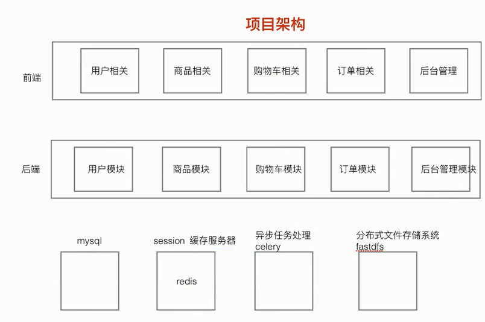
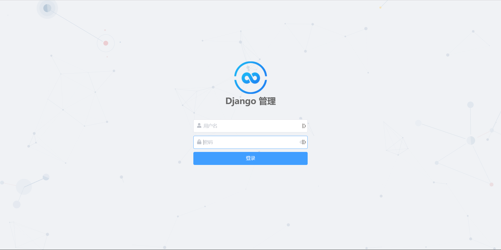
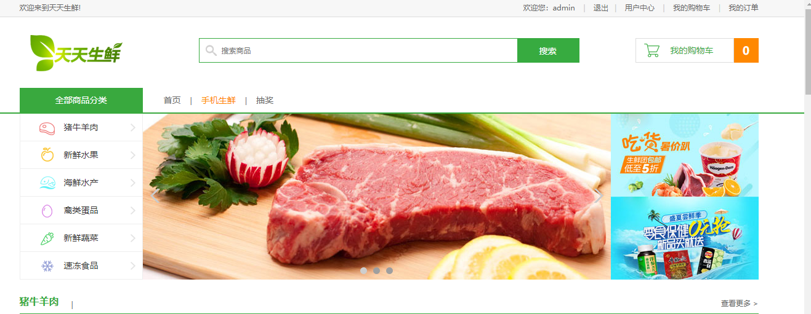
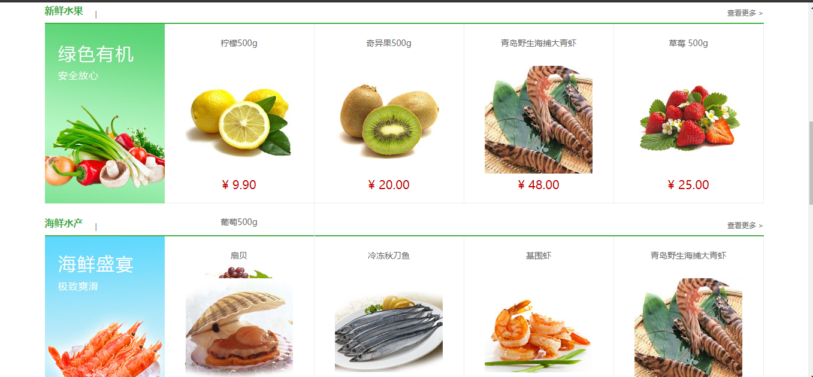
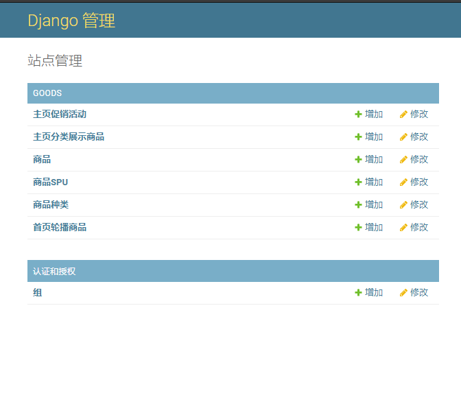

# 快速开始指导

[](https://github.com/Pad0y/Django2_dailyfresh/blob/master/LICENSE)[](https://github.com/Pad0y/Django2_dailyfresh)[](https://blog.csdn.net/qq_34356800)[](https://www.travis-ci.org/Pad0y/Django2_dailyfresh)

该项目是一个基于`Djaong 2.x`的电商项目，包含了实际开发中的电商项目中大部分的功能开发和知识点实践，是一个非常不错的django入门学习项目，希望对各位的学习有所帮助。

- 技术点

  ```
  celery：分别负责用户注册异步发送邮件以及不同用户登陆系统动态生成首页
  fdfs+nginx：存储网站静态文件，实现项目和资源分离，达到分布式效果
  haystack+whoosh+jieba：全文检索框架，修改底层haystack库使之对中文搜索更加友好
  redis：作为django缓存和session存储后端，提升网站性能，给予用户更好体验
  ```

- 开发环境

  ```text
  Language: Python>=3.6
  Framework: Django 2.x
  IDE: Pycharm
  OS: windows 10
  ```

- 功能模块

  - [x] 用户模块
      - [x] 注册
      - [x] 登录
      - [x] 激活(celery)
      - [x] 退出
      - [x] 个人中心
      - [x] 地址管理
  - [x] 商品模块
      - [x] 首页(celery)
      - [x] 商品详情
      - [x] 商品列表
      - [x] 搜索功能(haystack+whoosh)
  - [x] 购物车模块(redis)
      - [x] 增加
      - [x] 删除
      - [x] 修改
      - [x] 查询
  - [x] 订单模块
      - [x] 确认订单页面
      - [x] 订单创建
      - [x] 请求支付(支付宝)
      - [x] 查询支付结果
      - [x] 评论

- 项目结构图

  

---

## 部署

1. 创建环境，安装依赖

   ```bash
   # Create a virtual environment with conda
   conda create -n django python=3.7 --yes
   # Install the dependent libraries
   pip install -U pip
   pip install -r requirements.txt
   ```

2. [修改whoosh backend]((docs/jieba.md))

3. 修改配置文件,参照`settings.py.example`

   ```python
   1. 修改数据库配置信息
   DATABASES = {
       'default': {
           'ENGINE': 'django.db.backends.mysql',
           'NAME': 'dailyfresh',
           'HOST': 'localhost',
           'PORT': '3306',
           'USER': '#',  # 数据库用户名
           'PASSWORD': '#',  # 数据库密码
       }
   }
   
   2. 修改邮箱配置信息，163邮箱配置信息自查
   EMAIL_BACKEND = 'django.core.mail.backends.smtp.EmailBackend'
   EMAIL_HOST = 'smtp.qq.com'
   EMAIL_PORT = 25
   EMAIL_HOST_USER = 'xxxx@qq.com'  # 发送邮件的邮箱
   EMAIL_HOST_PASSWORD = 'xxxx'  # qq邮箱授权码
   # EMAIL_USE_TLS = True  # 与SMTP服务器通信时，是否启动TLS链接(安全链接)
   EMAIL_FROM = '天天生鲜<XXXXX@qq.com>'  # EMAIL_FROM 和 EMAIL_HOST_USER必须一样
   
   3. 填写fdfs的配置信息，注意端口是nginx的端口
   FDFS_STORAGE_URL = 'http://ip:port/'  
   
   4. 支付功能不需要用到的保持默认即可，需要用到移步官方文档或看配置文件注释
   ```

   

4. 创建数据库

   ```sql
   CREATE DATABASE `dailyfresh` CHARACTER SET 'utf8mb4';
   ```

5. 中间件

   1. FDFS

      FDFS服务在这个项目是作为存储静态图片的分布式文件系统,FDFS的安装配置是一件比较麻烦的事情,可以自行[编译安装](docs/FastDFS-description.md),也可用docker的方式启动(推荐)

      ```bash
      # pull image
      docker pull pad0y/fdfs:v3
      # 当storage和tracker在同宿主机时，必须使用host模式，否则文件上传返回storage内部地址，外部访问无法使用
      # MASTER_IP填写自己服务器的ip
      docker run -d --name fdfs\
          -p 8888:8888 \
          -p 22122:22122 \
          -p 23000:23000 \
          -e TZ=Asia/Shanghai \
          -e NET_VAR=eth0 \
          -e MASTER_IP={YOUR SERVER IP}\
          -v /mnt/fdfs:/var/local/fdfs \
          pad0y/fdfs:v3
      ```

      访问主机8888端口如果看到nginx默认页面则启动成功

   2. 数据库和异步组件

      ```
      # start service(mysql/redis)
      net start mysql
      net start redis
      # start celery task
      celery -A celery_tasks.tasks worker --loglevel=info -P eventlet
      ```

      celery4.x+ 在win10上存在兼容性问题,如果上述celery启动报错请参照: [windows上celery4.x不兼容问题完美解决办法](docs/celery_on_win10.md)

6. 启动

   ```bash
   # Database migration and generate tables
   python manage.py makemigrations
   python manage.py migrate
   # create the super administrator account
   python manage.py createsuperuser
   # create cache table
   python manage.py createcachetable
   # launch
   python manage.py runserver
   ```

## 演示

由于fdfs是用docker创建的没有任何数据,项目启动没有任何图片纯属正常吗,需要自己去后台管理添加







## 后言

别忘了来个start:star:~~~

