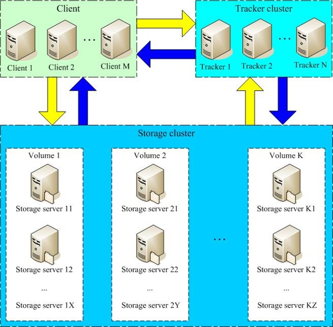
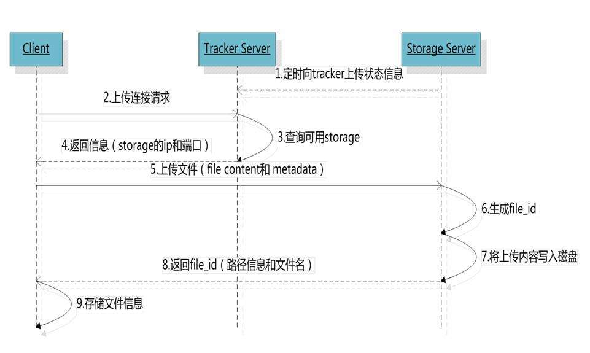
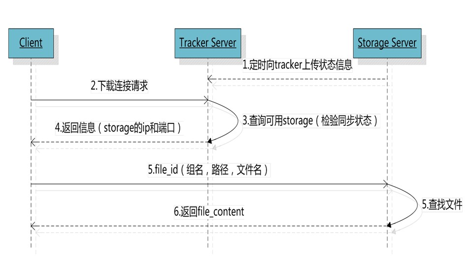

# FastDFS简介
- FastDFS是一个开源的轻量级分布式文件系统，由跟踪服务器（tracker server）、存储服务器（storage server）和客户端（client）
三个部分组成，主要解决了海量数据存储问题，特别适合以中小文件（建议范围：4KB < file_size <500MB）为载体的在线服务。
- FastDFS是一个轻量级的开源分布式文件系统
- 主要解决了大容量的文件存储和高并发访问的问题，文件存取时实现了负载均衡
- FastDFS实现了软件方式的RAID，可以使用廉价的IDE硬盘进行存储
- 支持存储服务器在线扩容，支持相同内容的文件只保存一份，节约磁盘空间
# 系统架构图

---

## Storage server
Storage server（后简称storage）以组（卷，group或volume）为单位组织，一个group内包含多台storage机器，数据互为备份，存储空间以group内容量最小的storage为准，所以建议group内的多个storage尽量配置相同，以免造成存储空间的浪费。
以group为单位组织存储能方便的进行应用隔离、负载均衡、副本数定制（group内storage server数量即为该group的副本数），比如将不同应用数据存到不同的group就能隔离应用数据，同时还可根据应用的访问特性来将应用分配到不同的group来做负载均衡；缺点是group的容量受单机存储容量的限制，同时当group内有机器坏掉时，数据恢复只能依赖group内地其他机器，使得恢复时间会很长。
group内每个storage的存储依赖于本地文件系统，storage可配置多个数据存储目录，比如有10块磁盘，分别挂载在/data/disk1-/data/disk10，则可将这10个目录都配置为storage的数据存储目录。
storage接受到写文件请求时，会根据配置好的规则（后面会介绍），选择其中一个存储目录来存储文件。为了避免单个目录下的文件数太多，在storage第一次启动时，会在每个数据存储目录里创建2级子目录，每级256个，总共65536个文件，新写的文件会以hash的方式被路由到其中某个子目录下，然后将文件数据直接作为一个本地文件存储到该目录中。
---

## Tracker server
Tracker是FastDFS的协调者，负责管理所有的storage server和group，每个storage在启动后会连接Tracker，告知自己所属的group等信息，并保持周期性的心跳，tracker根据storage的心跳信息，建立group==>[storage server list]的映射表。
Tracker需要管理的元信息很少，会全部存储在内存中；另外tracker上的元信息都是由storage汇报的信息生成的，本身不需要持久化任何数据，这样使得tracker非常容易扩展，直接增加tracker机器即可扩展为tracker cluster来服务，cluster里每个tracker之间是完全对等的，所有的tracker都接受stroage的心跳信息，生成元数据信息来提供读写服务。
---

# Upload file
FastDFS向使用者提供基本文件访问接口，比如upload、download、append、delete等，以客户端库的方式提供给用户使用。
## 上传文件流程图

# Download file

---
# 安装
```shell script
cd /opt/fdfs-packge 
wget https://github.com/happyfish100/libfastcommon/archive/V1.0.39.tar.gz -SO libfastcommon.tar.gz
wget https://github.com/happyfish100/fastdfs/archive/V5.11.tar.gz -SO fastdfs.tar.gz
wget https://github.com/happyfish100/fastdfs-nginx-module/archive/V1.20.tar.gz -SO fastdfs-nginx-module.tar.gz

# 解压三个压缩包
$ tar -xf xxx.tar.gz
$ tar -xf xxx.tar.gz
$ tar -xf xxx.tar.gz
```
# 安装FastDFS依赖库
```shell script
$ cd libfastcommon-1.0.39
$ ./make.sh
$ ./make.sh install
```
# 安装 fastdfs
```shell script
$ cd fastdfs-5.11
$ ./make.sh
$ ./make.sh install
```
安装好后，程序是在/usr/bin目录下：
```shell script
$ which fdfs_trackerd
$ which fdfs_storaged
```
得到如下结果：/usr/bin/fdfs_trackerd,说明安装成功
配置文件是在/etc/fdfs目录下：
```shell script
$ ls /etc/fdfs
client_deploy.conf storage_ids.conf.sample  tracker.conf.sample storage.conf.sample
```
但是这些配置文件是不全的，而且都是模板，所以需要从fastdfs包中拷贝过来，并修改配置：
```shell script
$ cd fastdfs-5.11/conf
$ ls
anti-steal.jpg  client_deploy.conf  http.conf  mime.types  storage.conf  storage_ids.conf  tracker.conf
$ cp ./* /etc/fdfs
# 进去fastdfs-nginx-module-1.20文件夹，把mod_fastdfs.conf 也复制到/etc/fdfs
$ cp /opt/fdfs-package/fastdfs-nginx-module-1.20/src/mod_fastdfs.conf /etc/fdfs
```
# 修改配置
-  **vim /etc/fdfs/tracker.conf**
```shell script
# the tracker server port
port=22122

# the base path to store data and log files
# tracker文件存放位置，按需修改
base_path=/opt/fdfs-basepath/tracker  

# HTTP port on this tracker server
# 若是默认端口已有服务运行记得更改
http.server_port=6666
```
---
- **vim /etc/fdfs/storage.conf**
```shell script
# storage所属的组
group_name=group1

# the storage server port
port=23000

# the base path to store data and log files
# storage服务存放的位置，按需修改
base_path=/opt/fdfs-basepath/storage

# store_path#, based 0, if store_path0 not exists, it's value is base_path
# the paths must be exist
store_path0=/opt/fdfs-basepath/storage

# tracker服务器，虽然是同一台机器上，但是不能写127.0.0.1。这项配置可以出现一次或多次
tracker_server=191.8.1.77:22122

# the port of the web server on this storage server
# 填写nginx的端口号
http.server_port=8888
```
- **vim vi /etc/fdfs/client.conf**
```shell script
# the base path to store log files
base_path=/opt/fdfs-basepath/client
# tracker_server can ocur more than once, and tracker_server format is
#  "host:port", host can be hostname or ip address
tracker_server=191.8.1.77:22122
#HTTP settings
http.tracker_server_port=6666  # 必须和tracker.conf的端口一样
```
- **vim /etc/fdfs/mod_fastdfs.conf**
```shell script
# the base path to store log files
base_path=/tmp

# FastDFS tracker_server can ocur more than once, and tracker_server format is
#  "host:port", host can be hostname or ip address
# valid only when load_fdfs_parameters_from_tracker is true
tracker_server=191.8.1.77:22122

# the port of the local storage server
# the default value is 23000
storage_server_port=23000

# the group name of the local storage server
group_name=group1

# store_path#, based 0, if store_path0 not exists, it's value is base_path
# the paths must be exist
# must same as storage.conf
store_path0=/opt/fdfs-basepath/storage
#store_path1=/home/yuqing/fastdfs1
```
- 配置过程中有几点要注意：tracker_server
    - 确保配置中用到的目录已经创建了
    - 确保各种配置文件之间引用的端口一致。比如：
        - mod_fastdfs.conf文件中tracker_server的端口应跟tracker.conf中port一致；
        - mod_fastdfs.conf文件中storage_server_port的端口应跟storage.conf中port一致；
---

# 启动tracker和storage：
```shell script
fdfs_trackerd /etc/fdfs/tracker.conf start
fdfs_storaged /etc/fdfs/storage.conf start
```
可以用 ps aux | grep fdfs 查看当前是否运行
```text
root     19696  0.0  0.2 145648  2080 ?        Sl   08:52   0:00 /usr/bin/fdfs_trackerd /etc/fdfs/tracker.conf
root     19741  0.0  0.3  82292  2976 ?        Sl   08:52   0:00 /usr/bin/fdfs_storaged /etc/fdfs/storage.conf
root     21969  0.0  0.1  13232   940 pts/1    S+   09:11   0:00 grep --color=auto fdfs
```
netstat -unltp | grep fdfs 查看当前端口监听情况
```text
root@VM-91-67-ubuntu:/etc/fdfs# netstat -unltp | grep fdfs
tcp        0      0 0.0.0.0:23000           0.0.0.0:*               LISTEN      19741/fdfs_storaged
tcp        0      0 0.0.0.0:22122           0.0.0.0:*               LISTEN      19696/fdfs_trackerd
```
# fdfs_upload_file 测试上传
```shell script
fdfs_upload_file /etc/fdfs/client.conf /home/anti-steal.jpg
```

返回如下结果则证明配置成功
group1/M00/00/00/CmhbQ12DF9qAcZlDAABdrSqbHGQ055.jpg

# 安装fastdfs-nginx-module
```text
若是本地机子无nginx，则直接下载nginx源码加上编译选项fastdfs-nginx-module
若是当前系统已经有一个nginx在运行了，所以要先确认当前系统nginx的版本
然后到官网下载对应版本的nginx源码，然后查看系统nginx的编译选项，
用一模一样的编译选项外加fastdfs-nginx-module的源码，
重新编译一个nginx程序。用新的nginx替换系统的nginx。
因为编译安装nginx需要一段时间这边选择直接apt安装再替换
```
安装nginx
```text
root@VM-91-67-ubuntu:~/nginx-src# apt-get install nginx
root@VM-91-67-ubuntu:~/nginx-src# nginx -V
nginx version: nginx/1.10.3 (Ubuntu)
built with OpenSSL 1.0.2g  1 Mar 2016
TLS SNI support enabled
configure arguments: --with-cc-opt='-g -O2 -fPIE -fstack-protector-strong -Wformat -Werror=format-security -Wdate-time -D_FORTIFY_SOURCE=2' --with-ld-opt='-Wl,-Bsymbolic-functions -fPIE -pie -Wl,-z,relro -Wl,-z,now' --prefix=/usr/share/nginx --conf-path=/etc/nginx/nginx.conf --http-log-path=/var/log/nginx/access.log --error-log-path=/var/log/nginx/error.log --lock-path=/var/lock/nginx.lock --pid-path=/run/nginx.pid --http-client-body-temp-path=/var/lib/nginx/body --http-fastcgi-temp-path=/var/lib/nginx/fastcgi --http-proxy-temp-path=/var/lib/nginx/proxy --http-scgi-temp-path=/var/lib/nginx/scgi --http-uwsgi-temp-path=/var/lib/nginx/uwsgi --with-debug --with-pcre-jit --with-ipv6 --with-http_ssl_module --with-http_stub_status_module --with-http_realip_module --with-http_auth_request_module --with-http_addition_module --with-http_dav_module --with-http_geoip_module --with-http_gunzip_module --with-http_gzip_static_module --with-http_image_filter_module --with-http_v2_module --with-http_sub_module --with-http_xslt_module --with-stream --with-stream_ssl_module --with-mail --with-mail_ssl_module --with-threads
```
到官网下载对应版本的[nginx源码](http://nginx.org/download/nginx-1.10.3.tar.gz)，并解压，改名为nginx-src，然后进入nginx-src目录
为了方便编辑，复制上面信息，在nginx-src目录下创建一个custom_configure.sh文件，把复制的内容拷贝进去，并在最后加上fastdfs-nginx-module的源码：
```shell script
./configure \
--with-cc-opt='-g -O2 -fPIE -fstack-protector-strong -Wformat -Werror=format-security -Wdate-time -D_FORTIFY_SOURCE=2' \
--with-ld-opt='-Wl,-Bsymbolic-functions -fPIE -pie -Wl,-z,relro -Wl,-z,now' \
--prefix=/usr/share/nginx \
--conf-path=/etc/nginx/nginx.conf \
--http-log-path=/var/log/nginx/access.log \
--error-log-path=/var/log/nginx/error.log \
--lock-path=/var/lock/nginx.lock \
--pid-path=/run/nginx.pid \
--http-client-body-temp-path=/var/lib/nginx/body \
--http-fastcgi-temp-path=/var/lib/nginx/fastcgi \
--http-proxy-temp-path=/var/lib/nginx/proxy \
--http-scgi-temp-path=/var/lib/nginx/scgi \
--http-uwsgi-temp-path=/var/lib/nginx/uwsgi \
--with-debug \
--with-pcre-jit \
--with-ipv6 \
--with-http_ssl_module \
--with-http_stub_status_module \
--with-http_realip_module \
--with-http_auth_request_module \
--with-http_addition_module \
--with-http_dav_module \
--with-http_geoip_module \
--with-http_gunzip_module \
--with-http_gzip_static_module \
--with-http_image_filter_module \
--with-http_v2_module \
--with-http_sub_module \
--with-http_xslt_module \
--with-stream \
--with-stream_ssl_module \
--with-mail \
--with-mail_ssl_module \
--with-threads \
--add-module=/opt/fdfs-package/fastdfs-nginx-module-1.20/src
```
接下来下载各种依赖库
```shell script
sudo apt-get install libxml2 libxml2-dev libxslt-dev libgd-dev libgeoip-dev libpcre3 libpcre3-dev
```
修改fastdfs-nginx-module的src/config文件
```shell script
# 修改一下两项：
ngx_module_incs="/usr/include/fastdfs /usr/include/fastcommon/"
CORE_INCS="$CORE_INCS /usr/include/fastdfs /usr/include/fastcommon/"
# 执行 ./custom_configure.sh,若无权限自行添加
```

得到如下信息
```shell script
Configuration summary
  + using threads
  + using system PCRE library
  + using system OpenSSL library
  + md5: using OpenSSL library
  + sha1: using OpenSSL library
  + using system zlib library

  nginx path prefix: "/usr/share/nginx"
  nginx binary file: "/usr/share/nginx/sbin/nginx"
  nginx modules path: "/usr/share/nginx/modules"
  nginx configuration prefix: "/etc/nginx"
  nginx configuration file: "/etc/nginx/nginx.conf"
  nginx pid file: "/run/nginx.pid"
  nginx error log file: "/var/log/nginx/error.log"
  nginx http access log file: "/var/log/nginx/access.log"
  nginx http client request body temporary files: "/var/lib/nginx/body"
  nginx http proxy temporary files: "/var/lib/nginx/proxy"
  nginx http fastcgi temporary files: "/var/lib/nginx/fastcgi"
  nginx http uwsgi temporary files: "/var/lib/nginx/uwsgi"
  nginx http scgi temporary files: "/var/lib/nginx/scgi"
```
编译安装
```shell script
make && makke install
# make install 会在/usr/share/nginx/sbin目录下生成一个名为nginx的可执行文件
root@VM-91-67-ubuntu:~/nginx-src# ls /usr/share/nginx/sbin/
nginx
```
关闭系统原有的nginx，并备份好系统原来的nginx文件：
```shell script
nginx -s stop
cd /usr/sbin
mv /usr/sbin/nginx nginx_bak
ln -s /usr/share/nginx/sbin/nginx /usr/sbin/nginx
```
接下来配置nginx配置文件
```text
vim /etc/nginx/nginx.conf
```
添加http模块里边修改server如下，如若没有自行添加
```text
server{                                          
    listen  8888;                               
    location ~/group[0-9]/{                      
        root /opt/fastdfs-BasePath/storage/data; 
        ngx_fastdfs_module;                      
    }                                            
}                                                
```
重启所有服务
```text
service fdfs_tracker restart
service fdfs_storage restart
nginx -s top && nginx
```
访问测试
```text
$ fdfs_upload_file /etc/fdfs/client.conf /home/kali.jpg
group1/M00/00/00/CmhbQ12EIwqAeiLsAAWZC4LxnZI028.jpg
```
访问 ip:8888/group1/M00/00/00/CmhbQ12EIwqAeiLsAAWZC4LxnZI028.jpg

# 相关资源
- 源码地址：https://github.com/happyfish100/
- 下载地址：http://sourceforge.net/projects/fastdfs/files/
- 官方论坛：http://bbs.chinaunix.net/forum-240-1.html
