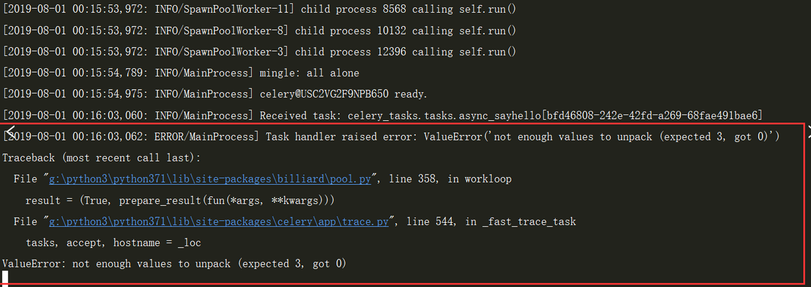
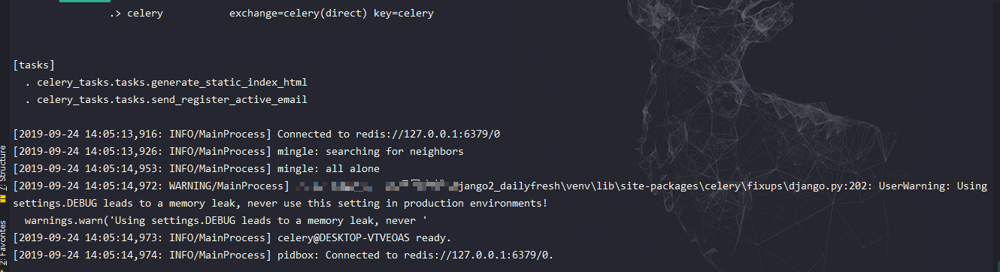

# celery4.x在win10不兼容的完美解决方法

## 简介
[官方文档](http://www.celeryproject.org/) | [中文文档](http://docs.jinkan.org/docs/celery/)

Celery 是一个简单、灵活且可靠的，处理大量消息的分布式系统，并且提供维护这样一个系统的必需工具。
它是一个专注于实时处理的任务队列，同时也支持任务调度。
---
## 使用情景
用户发起request，并等待response返回。在某些views中，可能需要执行一段耗时的程序，那么用户就会等待很长时间，造成不好的用户体验，
比如发送邮件、手机验证码等，将耗时任务添加进celery中执行，产生用户无阻碍体验效果。
---
##安装
```shell script
pip3 install django-celery
```
默认安装最新版的celery4.3.0，启动产生如下问题
```shell script
# windows和linux上的参数不大一样，此命令为windows下
$ celery -A celery_tasks.tasks worker --loglevel=info
```


解决方案：https://github.com/celery/celery/issues/4081

先安装一个eventlet
```shell script
pip3 install eventlet
```
然后启动worker的时候加一个参数
```shell script
celery -A <mymodule> worker -l info -P eventlet
```

