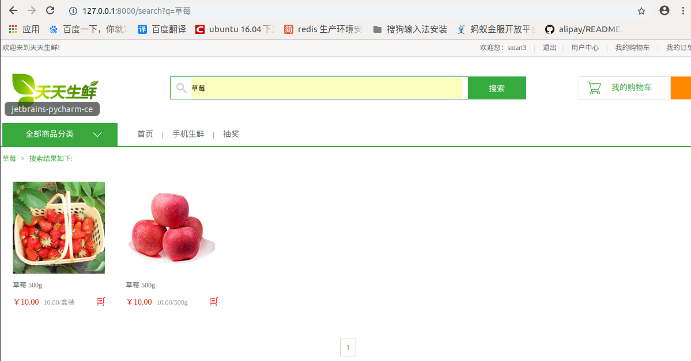

# jieba中文分词设置
- 进入到自己虚拟环境下的site-package/haystack/backends目录下
- 新建一个ChineseAnalyzer.py
```python
import jieba
from whoosh.analysis import Tokenizer, Token

class ChineseTokenizer(Tokenizer):
    def __call__(self, value, positions=False, chars=False,
                 keeporiginal=False, removestops=True,
                 start_pos=0, start_char=0, mode='', **kwargs):
        t = Token(positions, chars, removestops=removestops, mode=mode,
                  **kwargs)
        seglist = jieba.cut(value, cut_all=True)
        for w in seglist:
            t.original = t.text = w
            t.boost = 1.0
            if positions:
                t.pos = start_pos + value.find(w)
            if chars:
                t.startchar = start_char + value.find(w)
                t.endchar = start_char + value.find(w) + len(w)
            yield t

def ChineseAnalyzer():
    return ChineseTokenizer()
```
- 复制whoosh_backend.py文件修改为whoosh_cn_backend.py
- 修whoosh_cn_backend.py改两处地方，导入刚刚新建的文件，替换检索函数
```text
from .ChineseAnalyzer import ChineseAnalyzer
```
```text
查找
analyzer=StemmingAnalyzer()
改为
analyzer=ChineseAnalyzer()
```
再重建索引
```text
python manage.py rebuild_index
```

